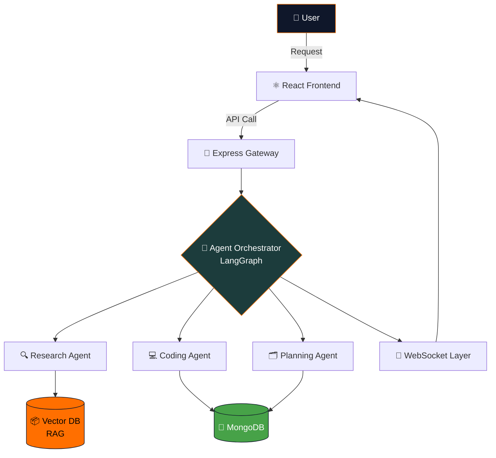

<div align="center">


### 🧠 Specialized AI agents that plan, research, and build — together

**MERN Stack · LangGraph Orchestration · Retrieval-Augmented Generation**

<p>
  
</p>

<p>
  
  
  
  
  
  
  
</p>

<p>
  <a href="https://cortex-ai-nine-nu.vercel.app"><b>🌐 Live Demo</b></a> ·
  <a href="#-getting-started"><b>⚙️ Getting Started</b></a> ·
  <a href="#-api-reference"><b>📡 API Reference</b></a> ·
 
</p>

</div>

<br/>

## 🧠 Overview

> *Multi-Agent AI Platform automates complex, multi-step tasks that a single LLM call handles poorly. Instead of one model juggling research, planning, and execution at once, specialized agents each own a slice of the problem and hand off work through a LangGraph orchestration layer, while a RAG pipeline keeps every response grounded in real, retrievable data. Built for teams that need traceable, reliable automation — not another chatbot wrapper.*

This platform lets several purpose-built AI agents — **research**, **coding**, **planning** — collaborate on multi-step tasks through a **LangGraph** orchestration layer. A **RAG pipeline** grounds agent responses in real, retrievable data rather than relying on model memory alone.

<br/>

## ✨ Key Features

<table>
<tr>
<td width="50%">

### 🤖 Multi-Agent Orchestration
Agents coordinate via LangGraph state machines to break down and solve complex tasks step by step.

### 📚 Retrieval-Augmented Generation
Agents pull grounded context from a vector database before responding — no hallucinated answers.

### 🔐 Secure Authentication
JWT-based auth with role-based access control out of the box.

</td>
<td width="50%">

### ⚡ Real-Time Updates
WebSocket-powered live agent status and streaming responses.

### 🧩 Microservices Architecture
Independently deployable, horizontally scalable backend services.

### 📊 Monitoring Dashboard
Visual tracking of agent tasks, logs, and performance.

</td>
</tr>
</table>

<br/>

## 🏗️ Architecture



<br/>

## 🛠️ Tech Stack

<div align="center">

| Layer | Technologies |
|:---|:---|
| **Frontend** |   |
| **Backend** |   |
| **Database** |  |
| **AI / Agents** |   |
| **Vector Store** |  |
| **DevOps** |  |

</div>

<br/>

## ⚙️ Getting Started

### Prerequisites


### Installation

```bash
# 1. Clone the repository
git clone https://github.com/Aniruddha-Shukla/CORTEX-AI.git
cd CORTEX-AI

# 2. Install dependencies
cd backend && npm install
cd ../frontend && npm install

# 3. Configure environment variables
cd ../backend
cp .env.example .env

# 4. Run the app
npm run dev                      # backend
cd ../frontend && npm run dev    # frontend
```

<div align="center">

### 🎉 The app runs at [cortex-ai-nine-nu.vercel.app](https://cortex-ai-nine-nu.vercel.app)

</div>

<br/>

## 🔑 Environment Variables

Create a `.env` file in `backend/`:

```env
PORT=5000
MONGO_URI=your_mongodb_connection_string
JWT_SECRET=your_jwt_secret
OPENAI_API_KEY=your_openai_api_key
VECTOR_DB_API_KEY=your_vector_db_key
```

> ⚠️ **Never commit `.env`** — confirm it's listed in `.gitignore`.

<br/>

## 📁 Project Structure

```
CORTEX-AI/
├── backend/
│   ├── agents/         # Research, coding, planning agent logic
│   ├── controllers/
│   ├── models/
│   ├── routes/
│   ├── services/        # LangGraph orchestration, RAG pipeline
│   └── server.js
├── frontend/
│   └── src/
│       ├── components/
│       ├── pages/
│       └── App.jsx
├── docker-compose.yml
└── README.md
```

<br/>

## 📡 API Reference

<div align="center">

| Method | Endpoint | Description |
|:---:|:---|:---|
|  | `/api/auth/register` | Register a new user |
|  | `/api/auth/login` | Authenticate a user, returns a JWT |
|  | `/api/agents/task` | Submit a new task to the agent orchestrator |
|  | `/api/agents/status/:id` | Get status of a running agent task |
|  | `/api/agents/history` | Retrieve past agent task history |

</div>

<br/>

## 🗺️ Roadmap

- [ ] 🌊 Streaming responses for all agents
- [ ] 🔌 Support for additional LLM providers
- [ ] 🧠 Persistent agent memory
- [ ] ✅ Unit + integration test coverage
- [ ] 🚀 CI/CD pipeline for auto-deployment

<br/>

## 🤝 Contributing

Contributions make the open-source community amazing — any contribution is **greatly appreciated**.

1. Fork the repository
2. Create a feature branch — `git checkout -b feature/AmazingFeature`
3. Commit your changes — `git commit -m 'Add AmazingFeature'`
4. Push the branch — `git push origin feature/AmazingFeature`
5. Open a Pull Request

<br/>

---

<div align="center">

### Built by **Aniruddha Shukla**

<p>
  <a href="https://www.linkedin.com/in/aniruddhashuklanie/"></a>
  <a href="https://github.com/Aniruddha-Shukla"></a>
</p>

**⭐ If this project helped you, consider giving it a star!**


</div>
