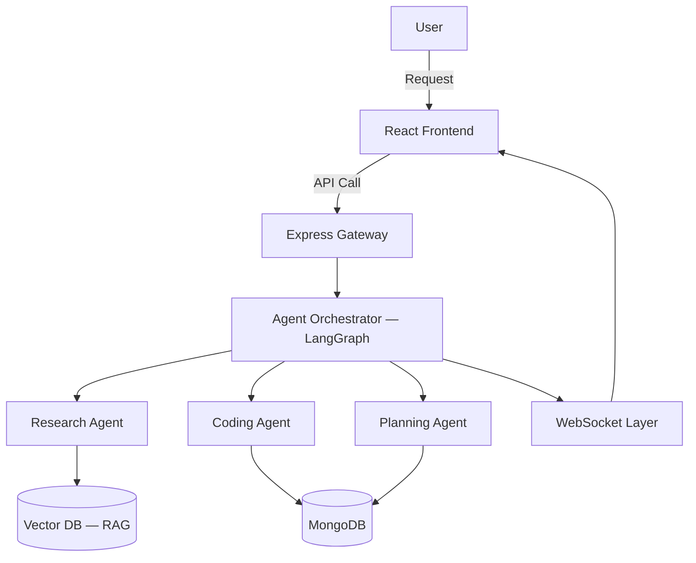

<div align="center">

# 🚀 Multi-Agent AI Platform

**A production-ready multi-agent system where specialized AI agents collaborate to complete complex tasks — built with the MERN stack, LangGraph orchestration, and Retrieval-Augmented Generation.**

<p>
  
  
  
  
</p>


</div>


## 🧠 Overview

> ✏️ *Multi-Agent AI Platform automates complex, multi-step tasks that a single LLM call handles poorly. Instead of one model juggling research, planning, and execution at once, specialized agents each own a slice of the problem and hand off work through a LangGraph orchestration layer, while a RAG pipeline keeps every response grounded in real, retrievable data. It's built for teams that need traceable, reliable automation — not another chatbot wrapper.*

This platform lets several purpose-built AI agents — research, coding, planning — collaborate on multi-step tasks through a **LangGraph** orchestration layer. A **RAG pipeline** grounds agent responses in real, retrievable data rather than relying on model memory alone.

---

## ✨ Key Features

| Feature | Description |
|---|---|
| 🤖 **Multi-Agent Orchestration** | Agents coordinate via LangGraph state machines to break down and solve complex tasks |
| 📚 **Retrieval-Augmented Generation** | Agents pull grounded context from a vector database before responding |
| 🔐 **Secure Authentication** | JWT-based auth with role-based access control |
| ⚡ **Real-Time Updates** | WebSocket-powered live agent status and streaming responses |
| 🧩 **Microservices Architecture** | Independently deployable, horizontally scalable backend services |
| 📊 **Monitoring Dashboard** | Visual tracking of agent tasks, logs, and performance |

---

## 🏗️ Architecture



> ✏️ *Update this diagram to match your actual agent flow, queues, or services.*

---

## 🛠️ Tech Stack

| Layer | Technologies |
|---|---|
| **Frontend** | React, Tailwind CSS |
| **Backend** | Node.js, Express |
| **Database** | MongoDB |
| **AI / Agents** | LangGraph, LangChain |
| **Vector Store** | *Qdrant* |
| **DevOps** | Docker |

---

## ⚙️ Getting Started

### Prerequisites
- Node.js ≥ 18.x
- MongoDB ≥ 6.x
- npm or yarn

### Installation

```bash
# 1. Clone the repository
git clone [https://github.com/YOUR_USERNAME/YOUR_REPO.git](https://github.com/Aniruddha-Shukla/CORTEX-AI.git)
cd YOUR_REPO

# 2. Install dependencies
cd backend && npm install
cd ../frontend && npm install

# 3. Configure environment variables
cd ../backend
cp .env.example .env

# 4. Run the app
npm run dev            # backend
cd ../frontend && npm run dev   # frontend
```

The app runs at `(https://cortex-ai-wi2y.vercel.app/)` 🎉

---

## 🔑 Environment Variables

Create a `.env` file in `backend/`:

```env
PORT=5000
MONGO_URI=your_mongodb_connection_string
JWT_SECRET=your_jwt_secret
OPENAI_API_KEY=your_openai_api_key
VECTOR_DB_API_KEY=your_vector_db_key
```

> ⚠️ Never commit `.env` — confirm it's listed in `.gitignore`.

---

## 📁 Project Structure

```
multi-agent-ai-platform/
├── backend/
│   ├── agents/        # Research, coding, planning agent logic
│   ├── controllers/
│   ├── models/
│   ├── routes/
│   ├── services/       # LangGraph orchestration, RAG pipeline
│   └── server.js
├── frontend/
│   └── src/
│       ├── components/
│       ├── pages/
│       └── App.jsx
├── docker-compose.yml
└── README.md
```

---

## 📡 API Reference

| Method | Endpoint | Description |
|---|---|---|
| `POST` | `/api/auth/register` | Register a new user |
| `POST` | `/api/auth/login` | Authenticate a user, returns a JWT |
| `POST` | `/api/agents/task` | Submit a new task to the agent orchestrator |
| `GET` | `/api/agents/status/:id` | Get status of a running agent task |
| `GET` | `/api/agents/history` | Retrieve past agent task history |

---

## 🗺️ Roadmap

- [ ] Streaming responses for all agents
- [ ] Support for additional LLM providers
- [ ] Persistent agent memory
- [ ] Unit + integration test coverage
- [ ] CI/CD pipeline for auto-deployment

---

## 🤝 Contributing

1. Fork the repository
2. Create a feature branch (`git checkout -b feature/AmazingFeature`)
3. Commit your changes (`git commit -m 'Add AmazingFeature'`)
4. Push the branch (`git push origin feature/AmazingFeature`)
5. Open a Pull Request

---


---

<div align="center">

**Aniruddha Shukla** · [LinkedIn](https://www.linkedin.com/in/aniruddhashuklanie/) · [GitHub](https://github.com/Aniruddha-Shukla) · 

⭐ If this project helped you, consider giving it a star!

</div>
