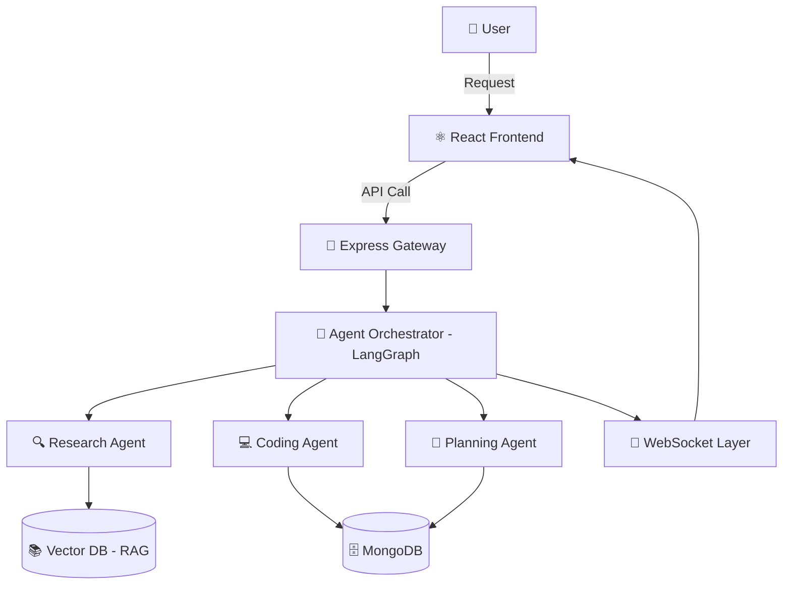

<div align="center">

# 🚀 Multi-Agent AI Platform

### Production-Ready Multi-Agent System for Enterprise Task Automation

<p>
  
  
  
  
</p>

<p>
  
  
  
  
</p>

**A scalable, multi-agent AI platform where specialized agents collaborate to complete complex tasks — built with the MERN stack, LangGraph orchestration, and Retrieval-Augmented Generation.**

[🎥 Watch the Build Series](#-video-walkthrough) • [🚀 Live Demo](#-live-demo) • [📖 Documentation](#-documentation) • [🐛 Report Bug](../../issues)

</div>

---

## 📌 Table of Contents

- [Overview](#-overview)
- [Key Features](#-key-features)
- [Architecture](#-architecture)
- [Tech Stack](#-tech-stack)
- [Impact & Results](#-impact--results)
- [Screenshots / Demo](#-screenshots--demo)
- [Getting Started](#-getting-started)
- [Environment Variables](#-environment-variables)
- [Project Structure](#-project-structure)
- [API Reference](#-api-reference)
- [Video Walkthrough](#-video-walkthrough)
- [Roadmap](#-roadmap)
- [Contributing](#-contributing)
- [License](#-license)
- [Contact](#-contact)

---

## 🧠 Overview

> ✏️ *Write 3–4 sentences here describing the problem this platform solves, who it's for, and why a multi-agent approach was chosen over a single-agent/monolithic AI system.*

This platform enables multiple specialized AI agents to **collaborate, delegate, and execute** complex, multi-step tasks autonomously. Each agent is purpose-built (e.g., research agent, coding agent, planning agent) and communicates through an orchestration layer powered by **LangGraph**, with a **RAG pipeline** grounding responses in real, up-to-date data instead of relying purely on model memory.

---

## ✨ Key Features

| Feature | Description |
|---|---|
| 🤖 **Multi-Agent Orchestration** | Agents coordinate via LangGraph state machines to break down and solve complex tasks |
| 📚 **Retrieval-Augmented Generation (RAG)** | Agents pull grounded, contextual knowledge from a vector database before responding |
| 🔐 **Secure Authentication** | JWT-based auth with role-based access control |
| ⚡ **Real-Time Updates** | WebSocket-powered live agent status and streaming responses |
| 🧩 **Microservices Architecture** | Independently deployable, scalable backend services |
| 📊 **Agent Monitoring Dashboard** | Visual tracking of agent tasks, logs, and performance |
| ☁️ **Production-Ready Deployment** | Dockerized services with CI/CD-ready configuration |
| 🌐 **Responsive UI** | Built with React for a clean, modern user experience |

---

## 🏗️ Architecture



> ✏️ *Replace/expand this diagram if your actual agent flow differs — add or rename agents, queues, or services as per your implementation.*

---

## 🛠️ Tech Stack

<div align="center">

| Layer | Technologies |
|---|---|
| **Frontend** |   |
| **Backend** |   |
| **Database** |  |
| **AI / Agents** |   |
| **Vector Store (RAG)** | *e.g. Pinecone / Chroma / Weaviate — update with yours* |
| **DevOps** |  |

</div>

---

## 📈 Impact & Results

> ✏️ *This is your space to show measurable outcomes. Replace the placeholders below with real numbers, metrics, or qualitative outcomes from building/using this project.*

- 🕒 **Time Saved:** Reduced [X task]'s manual effort by **__%** through agent automation
- ⚙️ **Efficiency:** Processed **__ tasks/requests** with an average response time of **__ seconds**
- 🎯 **Accuracy:** Achieved **__%** accuracy on [benchmark/task] using the RAG pipeline
- 📦 **Scale:** Architecture supports **__ concurrent agent sessions**
- 🧪 **Learning Outcome:** *Describe what you personally learned — e.g., orchestration patterns, microservice scaling, prompt engineering for multi-agent handoffs*

---

## 🖼️ Screenshots / Demo

> ✏️ *Add screenshots or a GIF of the dashboard, agent chat, or workflow here.*

<div align="center">
  
</div>

### 🚀 Live Demo
🔗 [https://your-live-demo-link.com](https://your-live-demo-link.com)

---

## ⚙️ Getting Started

### Prerequisites

```bash
Node.js >= 18.x
MongoDB >= 6.x
npm or yarn
```

### Installation

```bash
# 1. Clone the repository
git clone https://github.com/YOUR_USERNAME/YOUR_REPO.git
cd YOUR_REPO

# 2. Install backend dependencies
cd backend
npm install

# 3. Install frontend dependencies
cd ../frontend
npm install

# 4. Set up environment variables (see below)
cp .env.example .env

# 5. Run backend
cd ../backend
npm run dev

# 6. Run frontend
cd ../frontend
npm run dev
```

The app should now be running at `http://localhost:3000` 🎉

---

## 🔑 Environment Variables

Create a `.env` file in the `backend` directory with the following:

```env
PORT=5000
MONGO_URI=your_mongodb_connection_string
JWT_SECRET=your_jwt_secret
OPENAI_API_KEY=your_openai_api_key
VECTOR_DB_API_KEY=your_vector_db_key
```

> ⚠️ Never commit your `.env` file. Make sure it's listed in `.gitignore`.

---

## 📁 Project Structure

```
multi-agent-ai-platform/
├── backend/
│   ├── agents/          # Individual agent logic (research, coding, planning...)
│   ├── controllers/
│   ├── models/
│   ├── routes/
│   ├── services/        # LangGraph orchestration, RAG pipeline
│   └── server.js
├── frontend/
│   ├── src/
│   │   ├── components/
│   │   ├── pages/
│   │   └── App.jsx
│   └── package.json
├── docker-compose.yml
└── README.md
```

---

## 📡 API Reference

| Method | Endpoint | Description |
|---|---|---|
| `POST` | `/api/auth/register` | Register a new user |
| `POST` | `/api/auth/login` | Authenticate user, returns JWT |
| `POST` | `/api/agents/task` | Submit a new task to the agent orchestrator |
| `GET` | `/api/agents/status/:id` | Get status of a running agent task |
| `GET` | `/api/agents/history` | Retrieve past agent task history |

> ✏️ *Update this table to match your actual routes.*

---

## 🎥 Video Walkthrough

This project is documented in a full build series:

| Part | Title | Duration |
|---|---|---|
| 1️⃣ | Build a Production-Ready Multi-Agent AI Platform \| MERN, RAG, LangGraph | 10:43:41 |
| 2️⃣ | Build a Production-Ready Multi-Agent AI Platform \| Part 2 | 9:05:29 |
| 3️⃣ | Build a Production-Ready Multi-Agent AI Platform \| Deployment Part | 4:21:13 |

---

## 🗺️ Roadmap

- [ ] Add streaming responses for all agents
- [ ] Add support for additional LLM providers
- [ ] Implement agent memory persistence
- [ ] Add unit + integration test coverage
- [ ] CI/CD pipeline for auto-deployment

---

## 🤝 Contributing

Contributions are welcome! 🎉

1. Fork the repository
2. Create your feature branch (`git checkout -b feature/AmazingFeature`)
3. Commit your changes (`git commit -m 'Add some AmazingFeature'`)
4. Push to the branch (`git push origin feature/AmazingFeature`)
5. Open a Pull Request

---

## 📄 License

Distributed under the **MIT License**. See `LICENSE` for more information.

---

## 📬 Contact

<div align="center">

**Your Name**

[](https://linkedin.com/in/YOUR_PROFILE)
[](https://github.com/YOUR_USERNAME)
[](https://twitter.com/YOUR_HANDLE)

⭐ **If this project helped or inspired you, consider giving it a star!** ⭐

</div>
